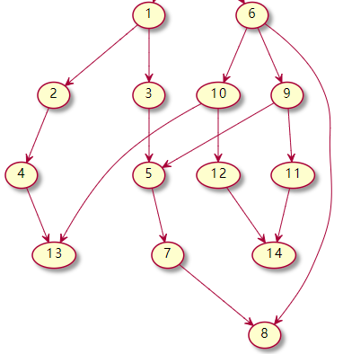

# fast-task
DAG任务编排执行


### 创建一个任务

- 继承：AbstractTask
- 初始化任务实例，设置任务唯一标识taskId（必须），任务名称（非必须），任务依赖其他任务taskId（非必须）

example
````
public static class TestTask extends AbstractTask {

        private final List<String> dependencies;

        private final String name;

        public TestTask(String name, String taskId, List<String> dependencies) {
            super(taskId);
            this.name = name;
            this.dependencies = dependencies;
        }

        public String getName() {
            return name;
        }

        @Override
        public void doAction(DataContext dataContext) {
            long start = System.currentTimeMillis();
            try {
                // do something amazing
                dataContext.getData().put(getId(), getName());
                Thread.sleep(new Random().nextInt(3000));
            } catch (InterruptedException e) {
                e.printStackTrace();
            }
            long end = System.currentTimeMillis();
            logger.info("take time: {} ms", (end - start));
        }

        @Override
        public List<String> getDependencies() {
            return this.dependencies;
        }
    }
````


### 开始执行任务
sample graph



````
public void test() {
    List<TestTask> testTaskList = new ArrayList<>();
    TestTask task1 = new TestTask("任务1", "1", Lists.newArrayList());
    TestTask task2 = new TestTask("任务2", "2", Lists.newArrayList("1"));
    TestTask task3 = new TestTask("任务3", "3", Lists.newArrayList("1"));
    TestTask task4 = new TestTask("任务4", "4", Lists.newArrayList("2"));
    TestTask task5 = new TestTask("任务5", "5", Lists.newArrayList("3", "9"));
    TestTask task6 = new TestTask("任务6", "6", Lists.newArrayList());
    TestTask task7 = new TestTask("任务7", "7", Lists.newArrayList("5"));
    TestTask task8 = new TestTask("任务8", "8", Lists.newArrayList("6", "7"));
    TestTask task9 = new TestTask("任务9", "9", Lists.newArrayList("6"));
    TestTask task10 = new TestTask("任务10", "10", Lists.newArrayList("6"));
    TestTask task11 = new TestTask("任务11", "11", Lists.newArrayList("9"));
    TestTask task12 = new TestTask("任务12", "12", Lists.newArrayList("10"));
    TestTask task13 = new TestTask("任务13", "13", Lists.newArrayList("4", "10"));
    TestTask task14 = new TestTask("任务14", "14", Lists.newArrayList("11", "12"));
    testTaskList.add(task1);
    testTaskList.add(task2);
    testTaskList.add(task3);
    testTaskList.add(task4);
    testTaskList.add(task5);
    testTaskList.add(task6);
    testTaskList.add(task7);
    testTaskList.add(task8);
    testTaskList.add(task9);
    testTaskList.add(task10);
    testTaskList.add(task11);
    testTaskList.add(task12);
    testTaskList.add(task13);
    testTaskList.add(task14);
    DataContext dataContext = new Dat**aContext();
    long start = System.currentTimeMillis();
    FastTaskExecutor.execute(testTaskList, dataContext, threadPoolExecutor);
    long end = System.currentTimeMillis();
    logger.info("all take time: {} ms",  (end - start));
    logger.info("dataContext: {}", new Gson().toJson(dataContext));
    logger.info("task8: {}", new Gson().toJson(task8.getData()));
}
````

result print

````log
00:00:51.482 [thread-pool-1] INFO com.berry.fasttask.DagGraphManager - task start: 6
00:00:51.482 [thread-pool-0] INFO com.berry.fasttask.DagGraphManager - task start: 1
00:00:52.100 [thread-pool-0] INFO com.berry.fasttask.Test - take time: 616 ms
00:00:52.101 [thread-pool-0] INFO com.berry.fasttask.DagGraphManager - task done: 1
00:00:52.102 [thread-pool-3] INFO com.berry.fasttask.DagGraphManager - task start: 3
00:00:52.102 [thread-pool-2] INFO com.berry.fasttask.DagGraphManager - task start: 2
00:00:52.748 [thread-pool-3] INFO com.berry.fasttask.Test - take time: 646 ms
00:00:52.749 [thread-pool-3] INFO com.berry.fasttask.DagGraphManager - task done: 3
00:00:52.853 [thread-pool-1] INFO com.berry.fasttask.Test - take time: 1369 ms
00:00:52.853 [thread-pool-1] INFO com.berry.fasttask.DagGraphManager - task done: 6
00:00:52.858 [thread-pool-5] INFO com.berry.fasttask.DagGraphManager - task start: 10
00:00:52.857 [thread-pool-4] INFO com.berry.fasttask.DagGraphManager - task start: 9
00:00:53.324 [thread-pool-4] INFO com.berry.fasttask.Test - take time: 465 ms
00:00:53.324 [thread-pool-4] INFO com.berry.fasttask.DagGraphManager - task done: 9
00:00:53.324 [thread-pool-6] INFO com.berry.fasttask.DagGraphManager - task start: 5
00:00:53.324 [thread-pool-7] INFO com.berry.fasttask.DagGraphManager - task start: 11
00:00:53.709 [thread-pool-7] INFO com.berry.fasttask.Test - take time: 384 ms
00:00:53.709 [thread-pool-7] INFO com.berry.fasttask.DagGraphManager - task done: 11
00:00:54.053 [thread-pool-2] INFO com.berry.fasttask.Test - take time: 1951 ms
00:00:54.053 [thread-pool-2] INFO com.berry.fasttask.DagGraphManager - task done: 2
00:00:54.053 [thread-pool-0] INFO com.berry.fasttask.DagGraphManager - task start: 4
00:00:54.827 [thread-pool-6] INFO com.berry.fasttask.Test - take time: 1503 ms
00:00:54.827 [thread-pool-6] INFO com.berry.fasttask.DagGraphManager - task done: 5
00:00:54.827 [thread-pool-3] INFO com.berry.fasttask.DagGraphManager - task start: 7
00:00:55.292 [thread-pool-5] INFO com.berry.fasttask.Test - take time: 2434 ms
00:00:55.292 [thread-pool-5] INFO com.berry.fasttask.DagGraphManager - task done: 10
00:00:55.292 [thread-pool-1] INFO com.berry.fasttask.DagGraphManager - task start: 12
00:00:56.284 [thread-pool-3] INFO com.berry.fasttask.Test - take time: 1457 ms
00:00:56.284 [thread-pool-3] INFO com.berry.fasttask.DagGraphManager - task done: 7
00:00:56.284 [thread-pool-4] INFO com.berry.fasttask.DagGraphManager - task start: 8
00:00:56.425 [thread-pool-0] INFO com.berry.fasttask.Test - take time: 2372 ms
00:00:56.425 [thread-pool-0] INFO com.berry.fasttask.DagGraphManager - task done: 4
00:00:56.425 [thread-pool-7] INFO com.berry.fasttask.DagGraphManager - task start: 13
00:00:56.578 [thread-pool-4] INFO com.berry.fasttask.Test - take time: 294 ms
00:00:56.578 [thread-pool-4] INFO com.berry.fasttask.DagGraphManager - task done: 8
00:00:58.226 [thread-pool-1] INFO com.berry.fasttask.Test - take time: 2934 ms
00:00:58.226 [thread-pool-1] INFO com.berry.fasttask.DagGraphManager - task done: 12
00:00:58.226 [thread-pool-2] INFO com.berry.fasttask.DagGraphManager - task start: 14
00:00:58.325 [thread-pool-7] INFO com.berry.fasttask.Test - take time: 1900 ms
00:00:58.325 [thread-pool-7] INFO com.berry.fasttask.DagGraphManager - task done: 13
00:00:59.324 [thread-pool-2] INFO com.berry.fasttask.Test - take time: 1098 ms
00:00:59.324 [thread-pool-2] INFO com.berry.fasttask.DagGraphManager - task done: 14
00:00:59.325 [Test worker] INFO com.berry.fasttask.Test - all take time: 7861 ms
00:00:59.351 [Test worker] INFO com.berry.fasttask.Test - dataContext: {"data":{"11":"任务11","12":"任务12","13":"任务13","14":"任务14","1":"任务1","2":"任务2","3":"任务3","4":"任务4","5":"任务5","6":"任务6","7":"任务7","8":"任务8","9":"任务9","10":"任务10"},"executeErrorLog":{}}
BUILD SUCCESSFUL in 13s
3 actionable tasks: 3 executed
0:00:59: Task execution finished ':test --tests "com.berry.fasttask.Test.doJob"'.


````

More detail @see com/berry/fasttask/Test.java
